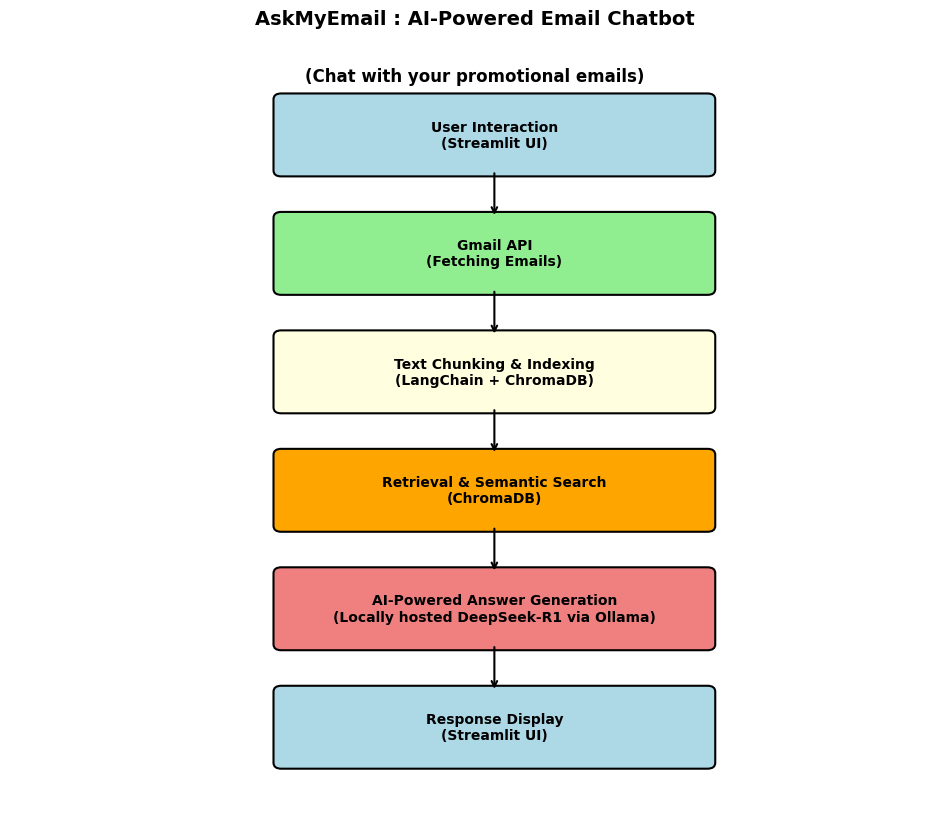

# 📨 AskMyEmail : DeepSeek AI-Powered Email RAG Chatbot

🚀 Retrieve, analyze, and chat with your emails using an AI-powered **Retrieval-Augmented Generation (RAG)** chatbot.  

🔍 Uses **Gmail API, Beautiful Soup, LangChain, ChromaDB, and DeepSeek R1 14B (via Ollama)** for intelligent email retrieval & responses.

---

## 📸 Video Demo 
📌 *Video Demo of the system:* [Link](https://www.youtube.com/watch?v=3kpnK6ljzY8) 

---

By default, AskMyEmail only accesses promotional emails to protect your email privacy. This is controlled by the following query in fetch_promotion_emails function:
```bash
query = f"label:promotions after:{date_n_days_ago}"
```
You can further customize email access by changing "promotions" to "inbox" here. 
```bash
query = f"label:inbox after:{date_n_days_ago}"
```


---

## 🔹 Features
✅ **Retrieve relevant emails** based on natural language queries.  
✅ **AI-powered response to queries** regarding the content of the emails.  
✅ **ChromaDB-based vector search** for efficient retrieval.  
✅ **LangChain-powered embeddings & LLM prompt processing.**  
✅ **DeepSeek 14B (via Ollama) for intelligent responses.**  
✅ **Streamlit UI** for an interactive chat experience.  

---

## 🛠️ Tech Stack
- **Python**
- **Streamlit** (UI)  
- **LangChain** (for embeddings, text processing, and LLM pipeline)  
- **ChromaDB** (for document retrieval)  
- **Gmail API** (for fetching emails)  
- **Ollama + DeepSeek R1 14B** (AI-powered response generation)  
- **BeautifulSoup** (for parsing email content)  

---

## ⚡ Installation & Setup

### 1️⃣ Clone the Repository
```bash
git clone https://github.com/saileshdwivedy30/Ask-My-Mail.git
cd Ask-My-Email
```

### 2️⃣ Set Up a Virtual Environment
```bash
python -m venv env
source env/bin/activate  # On macOS/Linux
env\Scripts\activate     # On Windows
```

### 3️⃣ Install Dependencies
```bash
pip install -r requirements.txt
```

### 4️⃣ Set Up Gmail API Credentials
- Obtain **`credentials.json`** from the Google API Console.  
- Place it in the **root directory** of the project.  

### 5️⃣ Run the Chatbot
```bash
streamlit run app.py
```

---

## 🎯 How It Works
1️⃣ **Fetch Emails** – Uses the Gmail API to fetch promotional emails.  
2️⃣ **Index Emails** – Processes and embeds email content using **LangChain** and stores it in **ChromaDB**.  
3️⃣ **Retrieve Relevant Emails** – Performs **semantic search (LangChain + ChromaDB)** to fetch contextually relevant emails.  
4️⃣ **Generate Answers** – Uses **LangChain Prompt Templates** and **DeepSeek 14B (via Ollama)** to generate AI-powered responses.  



---

## 🚀 Roadmap & Future Enhancements
✅ **Hybrid Search** (BM25 + Vector Similarity for better retrieval)  
✅ **Improve UI/UX** with better filtering & categorization  
✅ **Re-Ranking for better email prioritization**  
✅ **Deploy as a web app (e.g., on Hugging Face Spaces)**  

---

## 📄 License
📜 MIT License – Feel free to use, modify, and distribute this project.  

---

## 📬 Contact
📧 **Email:** sailesh.dwivedy@colorado.edu   
🔗 **LinkedIn:** [Link](https://www.linkedin.com/in/saileshdwivedy/)  
